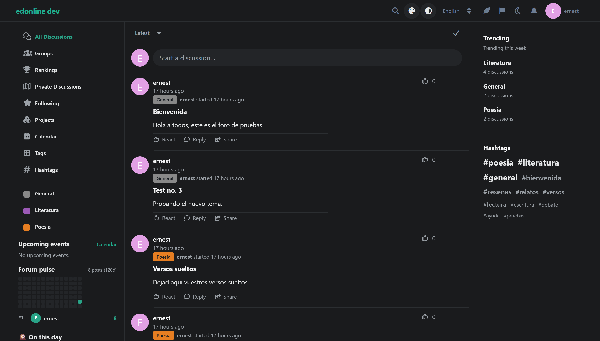
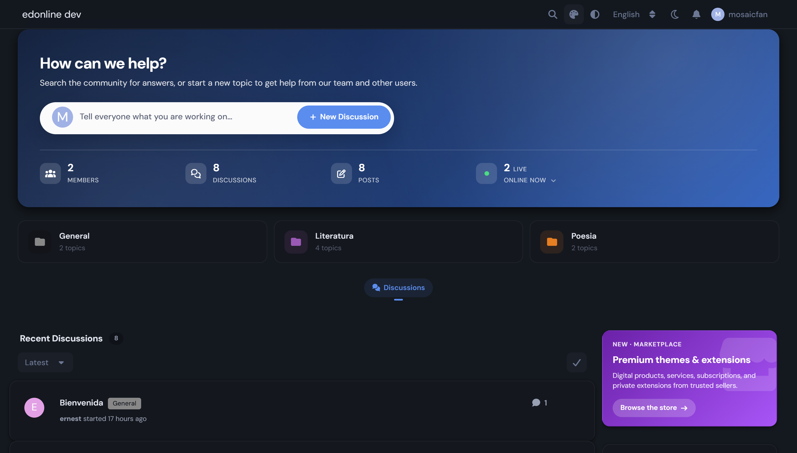
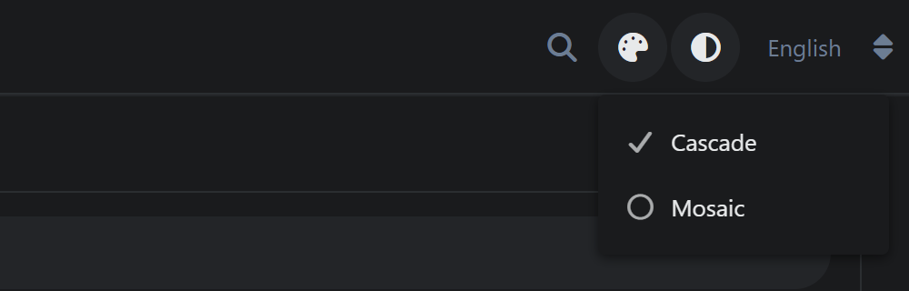
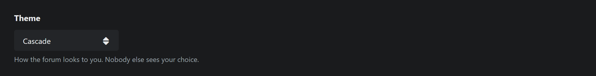
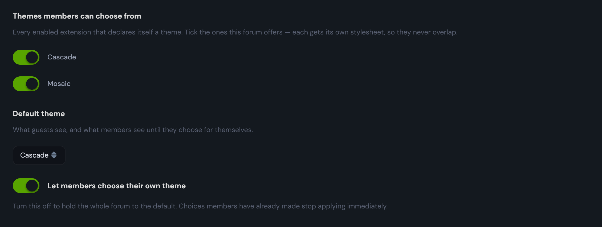

# Wardrobe

Install several themes on one **Flarum 2** forum and let every member — and every
guest — choose the one they see. The thing every other forum platform has had
for twenty years, and Flarum never has.


## Why Flarum can't do this today

Flarum compiles **every** enabled extension's LESS into a single `forum.css`,
and every extension's JavaScript into a single `forum.js`. Two themes enabled at
once means two themes fighting in one stylesheet *and* both themes' components
rendering for everyone — which is why nobody ships this.

Wardrobe compiles those same sources once per theme, each time with every
*other* theme left out of both bundles, and serves each visitor the pair that
belongs to their choice. No theme has to be modified, and core is not patched.

## The same forum, the same moment, two members





Not a recolour: each member gets that theme's stylesheet **and** its JavaScript,
so its components render and the other theme's do not.

## What people see

- **A theme switcher in the header** — one click, for members and guests alike.
- **A picker in member settings**, next to the other "how it looks to me"
  settings, with "Use the forum's theme" as its first option.
- **Admins** tick which installed themes the forum offers, pick the default, and
  can turn member choice off entirely to hold one look.







A member's choice is stored as a preference, so it follows them between devices.
A guest's is a cookie, read server-side on the next request — so a guest gets a
properly themed page, not one repainted after boot.

## How it works

| Piece | What it does |
|---|---|
| `ThemeRegistry` | which enabled extensions the owner declared to be themes, and which one an actor should see |
| `ThemeAssets` | builds one `forum-theme-<id>.css` and one `forum-theme-<id>.js` per theme, filtering the forum's own sources |
| `ApplyTheme` | swaps the stylesheet, the script and its preload per request; stamps `<html data-wardrobe-theme>`; publishes the theme list |
| `InvalidateThemeAssets` | marks every theme stale when core rebuilds, and queues the rebuild |
| `WarmThemeAssets` | recompiles off the request path, so no member pays for a compile |

Three facts in core make it possible without patching anything:

1. `Extend\Frontend` registers extension LESS as
   `$sources->addFile($path, $moduleName)`, so every CSS source knows which
   extension it came from. JS is attributed by the
   `flarum.extensions['<id>']=module.exports` line each extension's callback
   emits.
2. `Assets::$sources` is public and `flarum.assets.factory` builds a properly
   configured `Assets` for any name — including the LESS import overrides that
   `Extend\Theme` decorates the factory with, so themes that override core LESS
   files keep working.
3. `RevisionCompiler::commit()` hashes the compiled **output**, so a rebuild
   that changes nothing leaves the revision — and every member's cached copy —
   alone.

**Theme add-ons travel with their theme.** An extension that requires a theme
(Shattered Pact requires Bespoke) is excluded wherever that theme is, so an
add-on never loads reaching for exports that aren't there.

## Cost

Measured on a forum with 60+ extensions, Valkey cache, a queue worker:

| | |
|---|---|
| Added to a page request | **0.11 ms** p50, 0.16 ms p90 — against a ~70 ms page |
| Page latency with vs without | 70.2 ms vs 70.4 ms p50 over 50 requests — indistinguishable |
| Compile, per theme | ~450 ms, off the request path on the queue |
| Rebuild that changes nothing | revision unchanged, so **nobody re-downloads anything** |
| 20 concurrent requests on a stale theme | **1 compile per theme** (20 without the guard) |

Each member's stylesheet is *smaller* than the shared one, because it carries
one theme instead of all of them:

| stylesheet | bytes | Armory rules | Cascade rules | Mosaic rules |
|---|---|---|---|---|
| `forum.css` (what Flarum serves today) | 581,174 | 42 | 324 | 227 |
| `forum-theme-ernestdefoe-cascade.css` | 519,361 | 42 | 324 | **0** |
| `forum-theme-ernestdefoe-mosaic.css` | 546,423 | 42 | **0** | 227 |

Themes are compiled whole, never as a shared sheet plus a per-theme delta: a
theme that overrides core LESS variables (Mosaic overrides seven) would silently
stop working if its overrides were compiled apart from the rules they target.

## Notes for forum owners

- A guest who never touches the switcher sends no cookie, so guest pages stay
  byte-identical and cacheable. 🚨 If you run a full-page cache in front of
  Flarum, add `wardrobe_theme` to its cache key.
- Switching theme reloads the page. It has to: the running page is the other
  theme's JavaScript, not just its colours.
- Themes are detected by the `flarum-extension.category` each extension
  declares. Anything that calls itself a theme will be offered — tick the ones
  you mean.

## Installation

```bash
composer require ernestdefoe/wardrobe
```

## Licence

MIT
